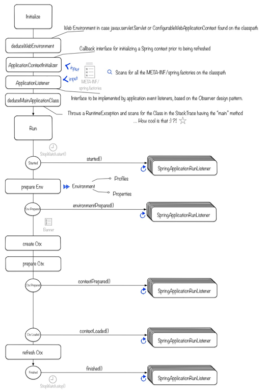

# Spring profiles

TIL

```
-Dspring.profiles.default 설정 안해도 알아서 alpha phase로 설정하고 싶을 때
1. ApplicationContextInitializer를 구현하고
2. META-INF/spring.factories에 넣자.

- spring 갖다쓰기만했는데, 동작을 이해해보자.
```

## how to

1. 아래 역할을 수행하는 프로젝트를 만들어서

```
1. ApplicationContextInitializer를 구현하고
2. META-INF/spring.factories에 넣자.
```

2. maven repo에 업로드하고

3. application 프로젝트 build.gradle에 이 프로젝트를 dependency추가하면

4. 자동으로 적용된다.

참고: [how-to-customize-the-environment-or-application-context
](https://docs.spring.io/spring-boot/docs/current/reference/html/howto-spring-boot-application.html#howto-customize-the-environment-or-application-context)

## SpringApplication.run() 



위 방법으로 하면 prepareCtx단계에 적용되는거다.

참고: spring-profile-note.key
